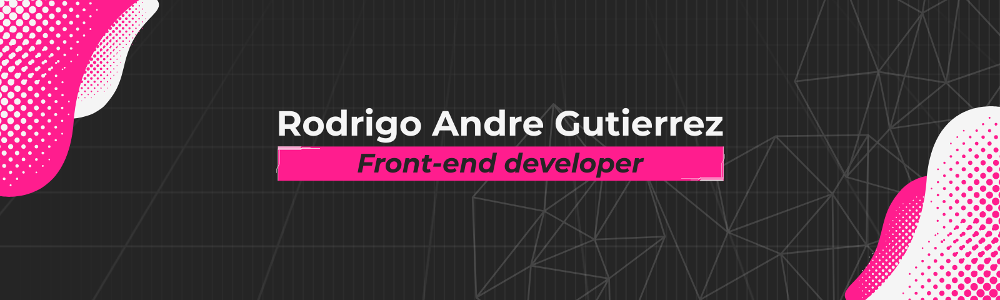

<!-- html -->

# Hola soy Rodan

Desarrollador front-end autodidacta con enfoque riguroso en accesibilidad, rendimiento, buenas prácticas y mantenimiento de código. Comprometido con los estándares de la industria, estudiados en profundidad y aplicados en proyectos personales que simulan entornos de trabajo reales (Gitflow, BEM, Conventional Commits, entre otros).

## Trabajo con:

***

